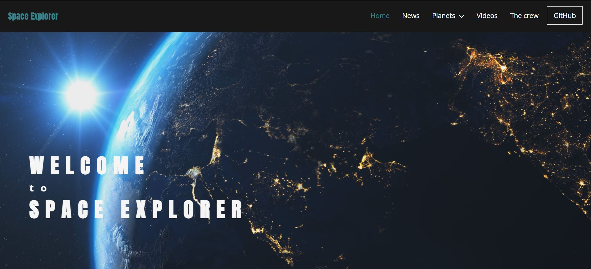

## :rocket: :artificial_satellite: :earth_africa: SPACE EXPLORER

### Build with React, CSS & API

## The project

Wander is a react application to.....

## How can I see it?

:sun_with_face: The project is hosted on xxx: link of the project

## What it looks like

<!-- [)] -->

## Task distribution

[@Stef14-bit]

- News with creation of a API
- Footer
- Modal and links on the footer

[@StefanDsd]

- Home page
- Video page

[@orianemgn]

- Navbar
- Planets pages with NASA API, Weather API and Solar-system API
- Crew page

## Credits

:raised_hands: Built and designed by [@Stef14-bit](https://github.com/Stef14-bit), [@StefanDsd](https://github.com/StefanDsd) & [@orianemgn](https://github.com/orianemgn/)
